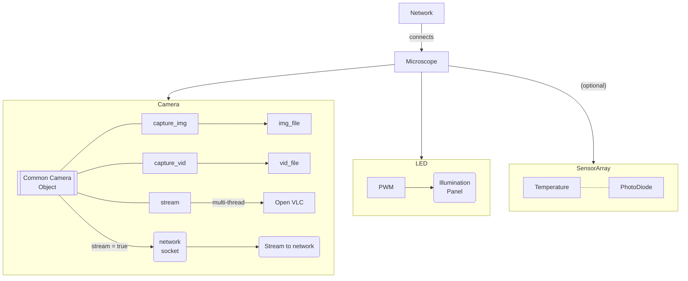
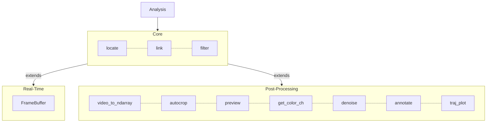
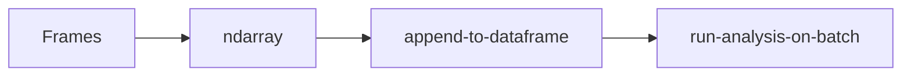

## Camera Object Construction

```mermaid
%%{init: {theme:'forest'}}%%
flowchart TD;
	Network --connects--> Microscope
	Microscope --> Camera
	Microscope --> LED
	Microscope --"(optional)"--> SensorArray
	subgraph LED
		PWM --> Panel("Illumination<br>Panel")
	end
	
	subgraph Camera
		CAM[["Common Camera<br>Object"]] --- capture_img
		capture_img --> img_file
		CAM --- capture_vid
		capture_vid --> vid_file
		CAM --- stream
		stream --multi-thread--> VLC["Open VLC"]
		CAM --"stream = true"--> Socket("network<br>socket")
		Socket --> Stream(Stream to network)
	end
	
	subgraph SensorArray
		Temperature -.- PhotoDiode
		%%PhotoDiode -.- PositionEncoders
	end
```

## Analysis

```mermaid
flowchart TD;
	Analysis --> Core(Core module)
	Core --extends--> Real-Time
	Core --extends--> Post-Processing
	
	subgraph Core
		locate -.- link -.- Filter["filter"]
	end
	
	subgraph Post-Processing
		video_to_ndarray -.- autocrop -.- preview -.- get_color_ch -.- denoise
		denoise -.- annotate -.- traj_plot
	end
	
	subgraph Real-Time
		FrameBuffer
	end
	
	
	
```

## Real-Time Analysis

```mermaid
flowchart LR;
	Frames --> ndarray --> append-to-dataframe --> run-analysis-on-batch 
```

